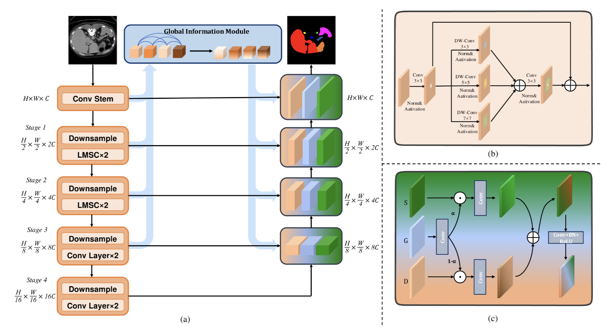
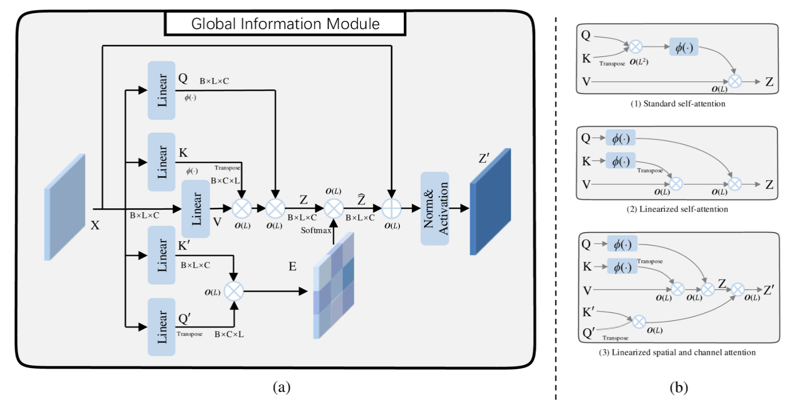

# GGLFNet
# Description

# Introduction
The GGLFNet network improves segmentation accuracy by leveraging global information to guide the fusion of local features. GGLFNet includes a global attention module that captures contextual dependencies at multiple resolutions while reducing the computational complexity of the self-attention mechanism to enhance model efficiency. Additionally, the Global Guidance Local Fusion module is introduced to ensure that global information effectively guides the fusion of local details and semantic features.

# Folder Structure
        ├── fig
        ├── data
        │   ├── Synapse
        │   │   ├── test_vol_h5
        │   │   ├── train_npz
        ├── model
        │   ├── GGLFNet
        │   │   ├── GGLFNet
        ├── my_dataset.py
        ├── predict.py
        ├── train.py
        ├── transforms.py
        ├── utils.py
# Requirements
        imgaug==0.4.0
        matplotlib==3.5.2
        MedPy==0.4.0
        mmcv_full==1.5.2
        numpy==1.19.5
        opencv_python==4.5.5.64
        opencv_python_headless==4.5.5.64
        timm==0.4.12
        torch==1.11.0
        torchvision==0.12.0
        tqdm==4.64.0
        wandb==0.12.21
To install all dependencies:

        pip install -r requirements.txt
